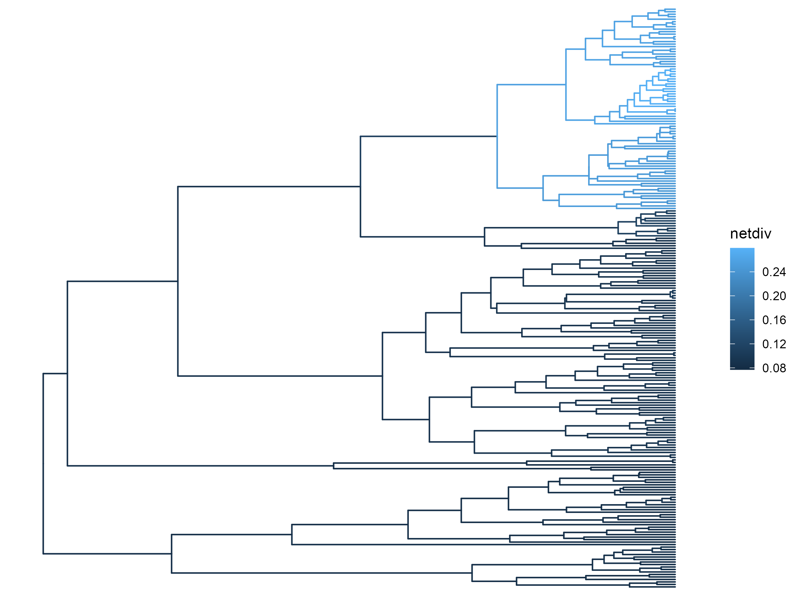

## RPesto

`RPesto` is an alternative implementation of the `Pesto` software in R. It can estimate branch-specific diversification rates for large trees.

## Installation

The backend of `RPesto` is implemented in `rust`, therefore you need to have `rust` and `cargo` installed. Please follow the instructions on [https://rustup.rs/](https://rustup.rs/).

Next, we will use the R-package `remotes` to install necessary R package dependencies

```R
install.packages("remotes")

library(remotes)

install_github("YuLab-SMU/treeio")
install_github("YuLab-SMU/tidytree")
```

Next we install `RPesto`

```R
install_github("kopperud/RPesto")
```

## Fitting the model

Now you can load `RPesto` and fit the model to your tree, and we need to specify what the probability of sampling the taxa are. This is usually set by calculating the number of the tips that are sampled in the tree, divided by the number of accepted species for the group. 

```R
library(RPesto)

data("primates")

sampling_fraction <- 0.635

tree <- fit_bds(primates, sampling_fraction)
```

This will give you a `tidytree` object which contains the average net-diversification rates for each branch

```
'treedata' S4 object'.

...@ phylo:

Phylogenetic tree with 233 tips and 232 internal nodes.

Tip labels:
  Galago_matschiei, Euoticus_pallidus, Euoticus_elegantulus,
Galagoides_zanzibaricus, Galagoides_demidoff, Galago_alleni, ...

Rooted; includes branch length(s).

with the following features available:
  'netdiv'.

# The associated data tibble abstraction: 465 × 4
# The 'node', 'label' and 'isTip' are from the phylo tree.
    node label                   isTip netdiv
   <int> <chr>                   <lgl>  <dbl>
 1     1 Galago_matschiei        TRUE  0.0869
 2     2 Euoticus_pallidus       TRUE  0.0874
 3     3 Euoticus_elegantulus    TRUE  0.0874
 4     4 Galagoides_zanzibaricus TRUE  0.0864
 5     5 Galagoides_demidoff     TRUE  0.0864
 6     6 Galago_alleni           TRUE  0.0870
 7     7 Galago_senegalensis     TRUE  0.0883
 8     8 Galago_moholi           TRUE  0.0883
 9     9 Galago_gallarum         TRUE  0.0881
10    10 Otolemur_garnettii      TRUE  0.0866
# ℹ 455 more rows
# ℹ Use `print(n = ...)` to see more rows
```

## Plotting the results

We can also use `ggtree` to plot the results
```R
library(ggtree)

ggtree(tree, aes(color = netdiv))
```

